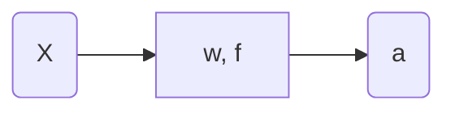

# Neural Networks

## Single neuron

Schema of a single neuron:

- $$\mathbf{x}$$: Vector of inputs. If it is the first neuron, it is known as Input Layer.
- The neuron {$$\mathbf{w}, f$$}:
  - $$\mathbf{w}$$: vector of weights.
  - $$f$$: activation function.

- $$a$$: Activation of the neuron.

So the activation of the neuron can be computed as follow:
$$
a = f(\mathbf{x^T}\cdot\mathbf{w})
$$
Where:
$$
\mathbf{x} = [1, x_1, ..., x_i, ..., x_m] \nonumber
$$

$$
\mathbf{w} = [w_0, w_1, ..., w_i, ..., w_m] \nonumber
$$

So $$m$$ is the number of samples and $$w_0$$ is the bias.